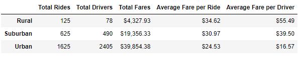

# PyBer_Analysis
##Overview of the analysis

The purpose of the analysis is to understand how the data differs by city type and how those differences can be used by decision-makers at PyBer.

##Results

Ride-sharing data includes total rides, total drivers, total fares, average fare per ride and driver, and total fare by city type by each rural, suburban, and urban city type. 

E.G. 

##Summary

Audience based marketing to rural areas can help improve Total Fare by City Type that drop in rural during Q1 compared to suburban and Urban. 

Towards Q2 urban and urban dropped while suburban city types increase suggest more marketing budgets allocations with seasonality. 

An overall strategy approach needs to use with appropriate allocations towards Rural, Suburban, and Urban to accommodate seasonality changes. 
